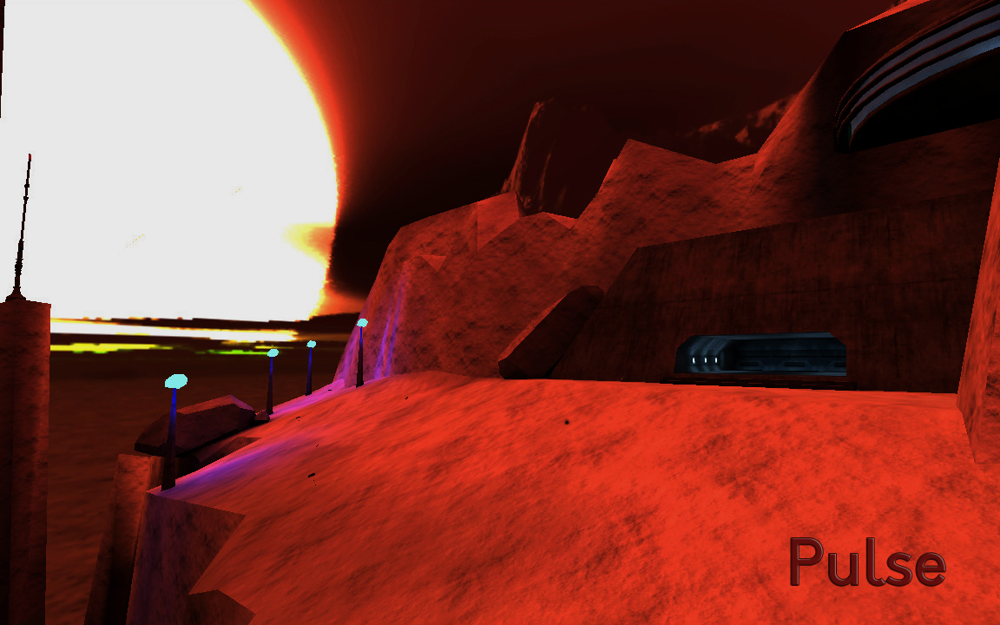

Pulse
=====

This is a map ported from the [Tremulous](https://tremulous.net) game to the [Unvanquished](https://unvanquished.net) game.

It features an abandoned base on a planet very near its sun.

As written on the original [pulse web page](https://sites.google.com/site/soubok2/tremulous_pulse_map):

> The external environment is very hostile. Nobody can survive more than five minutes outside the base.

> The company that exploits this base has decided to send some marines to understand why the base does not answer its messages.

It is ported from:

- `map-pulse-1.3.pk3`
- https://github.com/soubok/pulsemap
- `pulse.map`

This port is an Interstellar Oasis initiative: [github.com/InterstellarOasis/InterstellarOasis](https://github.com/InterstellarOasis/InterstellarOasis).

Levelshot
---------

Credits
-------

Unvanquished port:

* Thomas “illwieckz” Debesse (http://gg.illwieckz.net) <hidden mail="dev [ad] illwieckz.net"/>

Mapping:

* Soubok <hidden mail="soubok+github [ad] gmail.com"/>
* BillyRaz0r <hidden mail="billyRazOr2011 [ad] gmail.com"/>
* Thomas “illwieckz” Debesse

Legal
-----

Map and medias fall under the Creative Commons Attribution-ShareAlike 2.5 Generic License:  
http://creativecommons.org/licenses/by-sa/2.5/

History
-------

- InterstellarOasis port
- 1.3 build 200 by BillyRaz0r
- 1.21 build 175 by BillyRaz0r
- 1.2 build 150 by BillyRaz0r
- 1.1 build 130 by BillyRaz0r
- r1 revision 5 by BillyRaz0r
- r1 revision 4 by BillyRaz0r
- r1 revision 3 by BillyRaz0r
- r1 revision 2 by BillyRaz0r
- r1 revision 1 by BillyRaz0r
- r1 by BillyRaz0r
- beta4 by Soubok
- beta3 by Soubok
- beta2 by Soubok
- rc1-rv5 by Soubok
- rc1-rv4 by Soubok
- rc1-rv3 by Soubok
- rc1-rv2 by Soubok
- rc1 by Soubok

